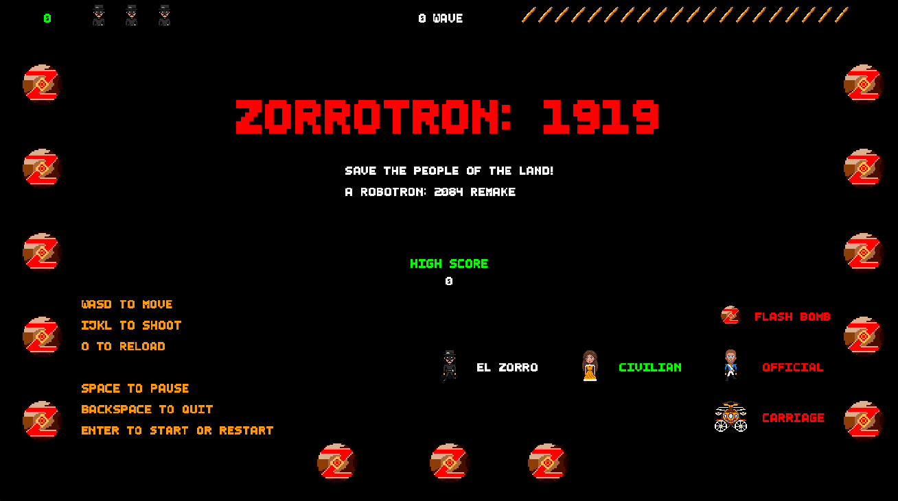

# ZORROTRON: 1919

**Zorrotron: 1919** is a reimagining of the classic _Robotron: 2084_ arcade game, built with GameMaker Studio 2. Step into the tall, black boots of the heroic masked vigilante, Zorro, as you combat tyranny and defend the downtrodden civilians of the town, all while maneuvering through obstacles along the way.

## Demo

Check out this YouTube [demo](https://youtu.be/XwNGttqinVo) video to see **Zorrotron: 1919** in action!

## Instructions for Gameplay

Save the people of the land!

- `WASD` - 8-Way Movement
- `IJKL` - 8-Way Shooting
- `O` - Reload Ammo

 

- `SPACE` - Pause Game
- `BACKSPACE` - Quit Game
- `ENTER` - Start/Restart Game

### Gameplay Tips

- **Avoid Obstacles** - Watch out for flash bombs dropped by town officials and runaway carriages!
- **Manage Ammo** - If you're low on ammo, hit the sweet spot in the Quick Time Event or rescue more civilians to replenish your supply. Stay vigilant—don’t expose yourself for too long!
- **Advance Through Levels** - Shoot all the town officials to progress to the next wave.

## Instructions for Local Use

### Option A: Run on GameMaker Studio 2

#### Prerequisites

- Install [Steam](https://store.steampowered.com/about/download) and create an active Steam account.
- Install GameMaker Studio 2 on your machine via Steam.
- Ensure all necessary dependencies are properly installed and configured within GameMaker Studio 2.

#### Steps to Run Zorrotron: 1919 Locally

1. Clone this repository to your desired directory.
2. Open GameMaker Studio 2.
3. Select "Open Project" and navigate to the directory where the cloned repository is located.
4. Open the `Zorrotron1919.yyp` project file.
5. Run the project by clicking the play button within GameMaker Studio 2.
6. Enjoy!

### Option B: Run the Windows Build

1. Download the `Zorrotron1919Windows.zip` file.
2. Extract the downloaded `.zip` file.
3. Open the extracted folder and run the `Zorrotron1919.exe` application.
4. Enjoy!

## About

**Zorrotron: 1919** adapts the gameplay of _Robotron: 2084_, where players fight against a robot invasion to save what remains of humanity. Featuring fast-paced movement and shooting mechanics in chaotic game waves, **Zorrotron: 1919** introduces a unique twist: limited ammunition.

Set in 19th-century California, _The Legend of Zorro_ follows Don Diego de la Vega, a noble vigilante who defends the oppressed people in town against tyrannical officials. While Zorro's signature weapon is his famed sword, he occasionally uses a pistol—a fitting choice for this game.

The limited ammo mechanic incentivizes players to be strategic about managing and reloading ammunition while avoiding hazards and defeating enemies, adding a heightened sense of tension and necessary stealth.

Slip on Zorro's mask and face the challenge ahead—play **Zorrotron: 1919**!

## Credits

Assets that I do not own are acknowledged in the [credits.md](./credits.md) file.

## Usage

While I appreciate interest in my project, please note the following:

- **Original Assets and Code**: The original artwork and code created specifically for this project are not to be used or modified without my explicit permission. If you'd like to use them, please contact me first.

- **Attribution**: If you do use any assets or code from this project that are credited to others, please ensure you follow the respective licenses and provide proper attribution.

- **Commercial Use**: This project and its original assets cannot be used for commercial purposes without my written consent.

## Contact

I’d love to hear from you! If you have any questions, feedback, or suggestions about **Zorrotron: 1919**, feel free to reach out.

    Email: eviii.professional@gmail.com

Thank you for playing **Zorrotron: 1919**!
